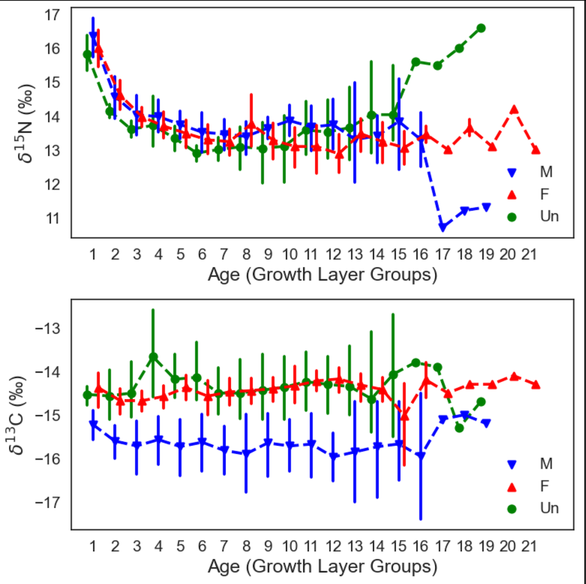

# Modeling life history parameters in marine mammals: Bayesian hierarchical analysis of ontogenetic dietary shifts in Indo-Pacific humpback dolphins

Authors:

Yuen-Wa Ho, Leszek Karczmarski\*, Wenzhi Lin, Mandy C.Y. Lo, Yuping Wu, David M. Baker\*  

This paper has been submitted for publication in *Ecological and Evolutionary Physiology*.

*Mean δ15N isotope values (‰) across different ages (represented by growth layer groups) in 38 Indo-Pacific humpback dolphin carcasses stranded ashore in the Pearl River Delta region between 2007 and 2018. Vertical bars represent standard deviation (± ‰). All analyzed individuals had at least five growth layer groups identified in their teeth, of which 14 were males (M), 18 were females (F), and the sex of 6 individuals was undetermined (Un).*

## Abstract
Weaning represents a pivotal ontogenetic process for mammals, marking the transition from parental provisioning to independent foraging.  In monophyodont species, distinct growth layer groups (GLGs) that are deposited in their teeth as the animals age represent a permanent chronological archive of physiological events across the animal’s lifetime.  Thus, biochemical analysis of annual dentine increments provide means to explore the animal’s physiological history.  We examined the age-specific pattern, individual-level variations, and sex-related differences in dentine nitrogen isotopic values in the Indo-Pacific humpback dolphin (Sousa chinensis) using tooth samples collected from 38 carcasses that stranded ashore in the Pearl River Delta region, southeast China, between 2007 to 2018. The longitudinal isotopic records archived in dolphin teeth offered insight into their foraging ecology and individual ontogenetic dietary life history. The overall pattern of δ15N isotopic values in the incremental layers, analyzed under a hierarchical Bayesian framework, indicates that humpback dolphins typically undergo an ontogenetic dietary shift (i.e., wean) before reaching the age of three years (mean 2.394 ± 0.143 years), albeit there is a considerable individual heterogeneity (ranging from 1.548 to 4.180 years), with males weaning consistently ~3.5 months earlier than females. Our study underscores the importance of quantifying ontogenetic parameters at the individual level as individual variations in life history events (such as the age of weaning) may affect broader population-level life history metrics. The application of hierarchical Bayesian modeling proved effective in quantifying individual heterogeneity and factoring it into the estimates of ontogenetic dietary  shifts — an important component in analyses of broader population-level processes.

## Software implementation
All source code used to generate the results and figures in the paper are in the `EEP-sousa-weaning.ipynb`.
The source code, implemented in Jupyter notebooks, generates all results and figures presented in the paper. It is structured as follows:
- Data import and preprocessing
- Bayesian hierarchical modeling
- Visualization of results

## Data Availability
The data supporting the findings of this study are withheld for ongoing analysis towards future publications. We aim to make the data publicly accessible upon the completion of the study. For interim data requests or metadata inquiries, please contact Yuen-Wa Ho [hoyuenwa@cetacea-institute.org].

## Getting the code
A copy of the repository is also archived at Zenodo: *insert DOI here*

## Contact Information
For any queries or further information, please reach out to:
- **Yuen-Wa Ho**
  - **Email:** hoyuenwa@cetacea-institute.org

- **Leszek Karczmarski**\*  
  - **Email:** leszek@cetacea-institute.org